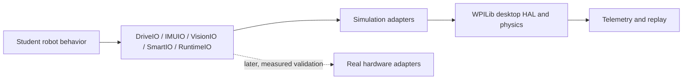

# Architecture decision

Updated: 2026-09-20. Status: proposed, documentation only.

Use **WPILib desktop simulation plus small replaceable I/O adapters**, not a replacement HAL, custom Linux distribution, or full Systemcore emulator.

The detailed [Linux simulation plan](research/LINUX_SIMULATION.md) defines fidelity limits, proposed data contracts, and acceptance tests. The separate [Systemcore architecture dossier](research/SYSTEM_ARCHITECTURE.md) describes the real platform from public evidence.

Hardware behavior and simulator behavior must never share an unlabeled diagram. Use utility-mode terminology where required by the selected 2027 API; keep legacy test-mode terminology explicitly tied to older material. No executable architecture is delivered by this documentation update.
