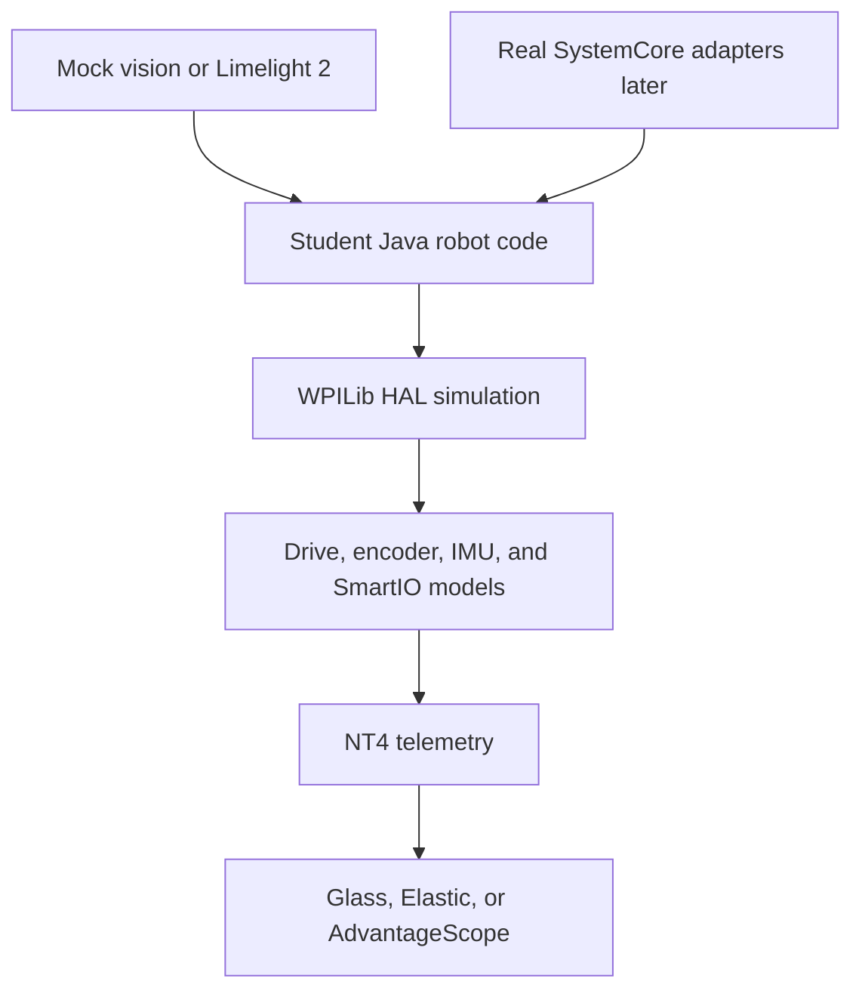

# Architecture

## Interface boundary

| Interface | Responsibility |
|---|---|
| `DriveIO` | Motor commands, encoder position and velocity, estimated current |
| `IMUIO` | Yaw, pitch, roll, acceleration, connection status |
| `VisionIO` | Target angles, pose estimates, latency, timestamp, result status |
| `SmartIO` | Digital, analog, PWM, mode, allocation, and ownership |
| `RuntimeIO` | Robot state, voltage, service health, faults, and logs |

Each interface receives a `Sim` implementation first. A `Real` implementation is added only when the corresponding hardware behavior has been measured.

## Teaching console

| Panel | Purpose |
|---|---|
| Robot State | Show disabled, autonomous, teleop, test, and simulated estop |
| SmartIO | Show port mode, value, owner, and duplicate allocation |
| CAN | Model `can_s0` through `can_s4`, devices, and utilization |
| Vision | Model up to four logical camera instances |
| Network | Show NT4 connectivity and simulated interface status |
| Processes | Show robot-code state, restart action, and recent logs |
| Faults | Inject stale vision, low voltage, dropped frames, and I/O conflicts |
| Plots | Compare setpoint, measurement, error, and controller output |

## Non-goals

- Cycle-accurate CAN or CAN FD.
- RP2350 firmware emulation.
- SystemCore OS image reproduction.
- FMS or venue-radio emulation.
- Accurate electrical power, noise, grounding, or brownout behavior.
