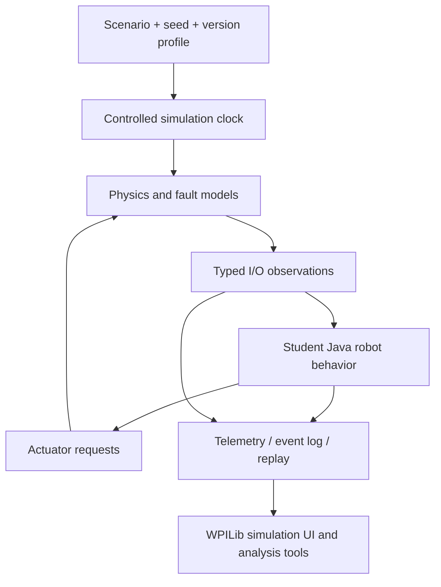

# Linux simulation plan

Research lead: @Gh0stlyKn1ght. Snapshot: 2026-09-21. **Proposed design only; no installation or simulation was performed.**

## Decision

Start with a small Java/WPILib desktop simulation and explicit hardware adapters. Use a supported Linux host profile, a release-matched simulation GUI and Driver Station, and deterministic tests. FIRST explicitly recommends using prerelease software in simulation to prepare for API changes. This is a better first step than attempting to boot a controller image in a generic VM. [S07](SOURCES.md#s07) [S14](SOURCES.md#s14)

## Debian, Ubuntu, and Kali

| Environment | Recommended role for this project | Evidence and limit |
|---|---|---|
| Debian 13 Trixie, 64-bit | Candidate supported simulation host | Listed in current mutable WPILib prerequisites |
| Ubuntu 26.04, 64-bit | Candidate supported simulation host | Listed in current docs and the alpha-7 release note |
| Kali | Public-source research workstation; host a supported guest for simulation | Not listed as supported by WPILib |
| Ubuntu 24.04 or older course machines | Keep existing working courses separate; use a supported guest for this alpha profile | Do not assume old WPILib requirements apply to 2027 |

The current installation page says other Linux distributions with the required glibc may work but are unsupported. That is not a guarantee for Kali. Prefer an x86-64 supported guest as the initial low-variation classroom target; verify the actual release assets before installation. Do not manually replace the host's glibc to satisfy a prerelease tool. [S10](SOURCES.md#s10)

The historical WPILib alpha-7 release note names Ubuntu 26.04, while the current mutable prerequisites additionally list Debian 13. Keep that source-date difference visible rather than pretending a mutable documentation page was part of the original alpha-7 release contract. [S10](SOURCES.md#s10) [S16](SOURCES.md#s16)

A Kali host with a Debian/Ubuntu guest is not an emulated Systemcore. It is a supported development environment running desktop robot simulation. Keep those labels visible in screenshots and lessons.

### Read-only host preflight, for later use

These commands inspect a local machine; they do not contact a robot or vendor server. They have not been run against the user's classroom machines.

```bash
uname -m
cat /etc/os-release
getconf GNU_LIBC_VERSION
free -h
df -h .
```

Record the output alongside the selected installer, Java runtime, WPILib release, Driver Station release, vendor set, and source commit. Use the official bundled Java/toolchain rather than making assumptions about the system Java executable.

## Driver Station alpha 8 changes the test matrix, not the design goal

FIRST Driver Station `v2027.0.0-alpha-8` was published 2026-09-14 with Linux x64 and arm64 assets. Its release notes include a fix to allow cameras on loopback during simulation, plus dashboard lookup, FMS, memory-leak, and alert-key fixes. [S41](SOURCES.md#s41)

That is relevant to a Linux classroom simulator because a camera stream hosted on the same simulation machine may now behave differently than under alpha 7. It does not prove the complete DS-to-simulation workflow works in our environment. The acceptance test must record the exact DS and WPILib versions.

## Post-alpha7 simulation work is merged, not released alpha 7

Recent `allwpilib` main commits add Driver Station alerts to the simulation GUI and display simulated devices as a slash-separated tree. Other main-branch work changes NetworkTables queue/subscription behavior and adds Java module support. [S42](SOURCES.md#s42)

These are useful signals for where the tooling is going, but they must not leak into a pinned alpha-7 lesson as if they were part of that tagged release. The first classroom profile should follow one released set. A later profile can be created when a newer WPILib tag contains the desired changes.

## Fidelity contract

| We propose to model | What passing that model does not prove |
|---|---|
| Robot lifecycle, enable gating, and command ownership | FMS certification or physical emergency-stop behavior |
| Differential-drive physics and sensor observations | Exact tire friction, backlash, or collision behavior |
| SmartIO allocation, modes, values, and conflicts | Pin timing, voltage tolerance, analog precision, or electrical safety |
| Logical CAN buses, device identity, delays, and loss | Real arbitration, termination, bit timing, or vendor CAN-FD feature parity |
| Vision pose/target observations with timestamps and validity | Reproduction of Limelight algorithms or Hailo performance |
| Logs, disk-budget faults, and service readiness states | Exact Linux service ordering, mount behavior, or boot duration |
| Proposed brownout and recovery scenarios | Measured thresholds or actual power-protection behavior |

The simulator must display **SIMULATED** and identify its selected profile. Hypothetical parameters need units and a visible provenance label. Never present a synthetic bus-utilization percentage as a measurement from actual hardware.

## Proposed architecture



Keep these interfaces small:

| Proposed interface | Contract |
|---|---|
| `DriveIO` | Requested voltage/output; wheel position, velocity, estimated current, validity |
| `IMUIO` | Orientation, angular rate, timestamp, frame convention, health |
| `VisionIO` | Coherent frame/pose observation, timestamp, latency, validity/rejection reason |
| `SmartIO` | Port selection, function, owner, value, allocation error |
| `RuntimeIO` | Robot state, selected mode, readiness, modeled power/storage faults |

Every observation should specify units and validity. Where multiple timestamps exist, distinguish capture time, receive time, and simulation time. Convert at API boundaries rather than spreading implicit conversions through student code. The recent timestamp changes make this a migration test, not cosmetic naming. [S11](SOURCES.md#s11) [S21](SOURCES.md#s21)

## Systemcore internal architecture is not the desktop simulation API

A post-alpha7 `allwpilib` main commit adds an AOS-to-NetworkTables bridge for selected realtime `mrccomm` data. It publishes ordinary NetworkTables topics for dashboards and logging while decoupling the realtime producer. [S42](SOURCES.md#s42)

This is useful architecture evidence, but it does not make AOS, ROS 2, or controller-internal processes a prerequisite for the Java/WPILib classroom simulator. Simulate the public application contracts first. Treat internal transports as research subjects only when their behavior becomes necessary to the test question.

## First vertical slice, after approval

Use a vendor-light drivetrain and one encoder/IMU model. Demonstrate manual driving, disable gating, and one stale-sensor fault. Add one synthetic vision observation stream only after deterministic motion and telemetry work. Keep a single selected 2027 template; compare Commands v2/v3 or OpModes later rather than teaching several evolving frameworks simultaneously.

A 50 Hz initial application loop is a project simplification, not a platform limit or a competition requirement. Faster loops require measured deadlines, sensor update rates, and control needs. Do not copy a team's high-frequency configuration without that analysis.

## Validation gates

| Test | Proposed acceptance condition |
|---|---|
| Version profile | WPILib, DS, host OS/arch, vendordeps, and source commit are recorded before a result is accepted |
| Repeatability | Same seed and input sequence produce equivalent state/event output |
| Disabled behavior | Actuator requests are neutral in the modeled disabled state |
| Sensor failure | Stale, missing, or invalid data is distinguishable from a valid zero |
| Multi-bus identity | Identical device numbers on different buses do not collide in the model |
| Port ownership | Conflicting SmartIO allocations produce an explicit failure |
| Timestamp migration | Unit conversions and out-of-order observations have tests |
| Vision fallback | Loss of a target cannot reuse old targeting data as fresh |
| Camera loopback | Selected DS/simulation pair can consume the documented local camera path without assuming alpha-8 fixes apply elsewhere |
| Logging | Mode changes, faults, and dropped observations are reconstructable |
| Classroom recovery | A fresh supported environment can reproduce a known-good exercise |

Write the tests before claiming parity with a real device. Later hardware adapters must be measured against the same contracts, with documented discrepancies rather than silently changing the simulator to hide them.

## Why not full OS emulation first?

A generic QEMU ARM `virt` machine is deliberately not a model of a particular board. Running an ARM Linux userspace would not automatically reproduce Systemcore-specific I/O, firmware, peripherals, or timing. The public cross-compilation examples establish a build target, not a complete emulator specification. Full-system emulation remains a possible separate research effort, but it is not necessary for this teaching goal. [S37](SOURCES.md#s37) [S17](SOURCES.md#s17)

Image-15 releases now publish Alpha/Beta aarch64 toolchain and kernel-source archives. That makes low-level build research easier, but it still does not provide a complete virtual hardware model. [S39](SOURCES.md#s39)

Containers can improve repeatability of build dependencies, but they share the host kernel and complicate GUI/gamepad access. A supported desktop guest is the simpler first teaching environment. This is our engineering tradeoff, not a claim that containers cannot work.

## Optional later SocketCAN lab

Linux virtual CAN can teach interface naming, message routing, and software fault handling without a physical bus. It does not reproduce bus speed, real arbitration, transceiver faults, or vendor-device firmware. Keep it a separate local lab, not a dependency of the first simulator and not a reason to attach to a competition robot. [S36](SOURCES.md#s36)

## Build workflow, intentionally not executed

After the gates are approved: obtain the matched installer from an official tagged release, generate the upstream minimal project, record `./gradlew tasks --all`, and use the simulation workflow documented for that release. Record the Driver Station build separately. Alpha-era task names and simulation behavior are changing, so do not hardcode a recipe from `main` or an older alpha without checking the generated project. [S11](SOURCES.md#s11) [S16](SOURCES.md#s16) [S41](SOURCES.md#s41) [S42](SOURCES.md#s42)
