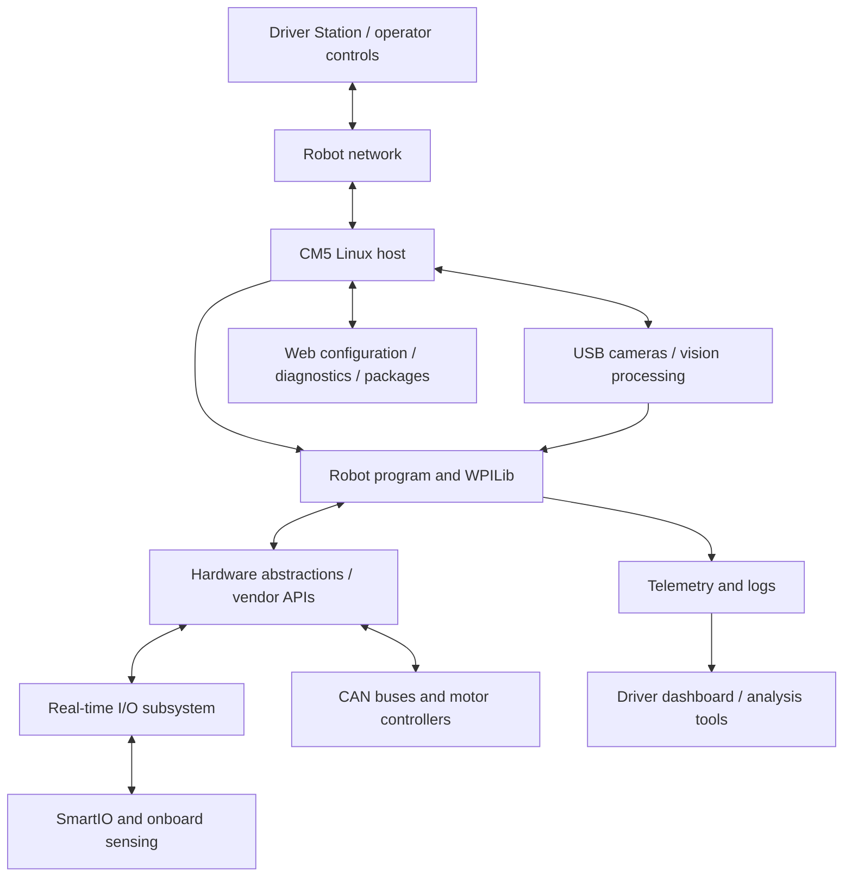

# How Systemcore fits together

Research lead: @Gh0stlyKn1ght. Snapshot: 2026-09-20. Diagrams are explanatory models, not vendor schematics.

## The mental model

Think of Systemcore as a robot computer plus a dedicated timing-oriented I/O subsystem, not simply a Raspberry Pi with extra sockets. The CM5/RP2350 division is documented by WPILib; the official testing and OS repositories show a surrounding environment for robot deployment, configuration, diagnostics, packages, and vision. [S15](SOURCES.md#s15) [S05](SOURCES.md#s05) [S06](SOURCES.md#s06)

This conceptual diagram intentionally does not specify every internal transport, driver, process boundary, or electrical connection. Do not infer an unpublished protocol from an arrow.

## Four paths to keep separate

**Control:** operator state and robot logic determine requested actuator behavior. The application reaches devices through selected WPILib and vendor interfaces. A connected dashboard is not, by itself, proof that the robot is enabled or safe to move.

**Observation:** sensor values, robot state, health, and logs are exposed for diagnosis. Treat a value's timestamp, validity, units, and source as part of the value. A plausible number can still be stale.

**Configuration:** team identity, image updates, packages, and device settings change the environment in which control runs. Configuration is not necessarily harmless while code is running. The OS notes explicitly describe stopping robot code during SmartIO type editing. [S06](SOURCES.md#s06)

**Recovery:** imaging and recovery use hardware-generation-specific procedures. A workflow valid for an early unit may be wrong for beta hardware. Recovery documentation needs an identified unit and known-good image, not a generic reset button diagram. [S05](SOURCES.md#s05)

These four categories are our architecture decomposition. They are useful for teaching ownership, failure isolation, and diagnosis; they are not a claim that the vendor uses those exact subsystem names.

## Boot and readiness

For research, distinguish power applied, Linux started, network reachable, real-time I/O healthy, robot code running, and Driver Station ready. A display turning on is not a complete readiness measurement. The public OS changelog reports improvements to several separate boot milestones, which reinforces the need to measure them independently on a later bench. [S06](SOURCES.md#s06)

Our proposed readiness model will therefore allow partial states: network available without code, code present without valid sensors, or telemetry attached while disabled. This is a simulation design choice. Exact service ordering, watchdog timing, and recovery behavior remain hardware-validation questions.

## CAN is a set of separate buses

The testing guide names five primary interfaces `can_s0` through `can_s4`, distinct from Motioncore's `can_d0` through `can_d19`. Vendor APIs also distinguish the selected bus. [S05](SOURCES.md#s05) [S18](SOURCES.md#s18)

Our logical device key should include the bus and vendor/device identity, not just a small device number. Duplicate IDs on one relevant bus must not be confused with the same number intentionally used on another. Logical utilization, loss, and timeout demonstrations should be labeled models, not real CAN-FD timing predictions.

Native CAN-FD hardware does not prove that every motor-controller feature, timestamping mode, firmware release, or license is supported on every bus. FIRST's transition policy and current vendor documentation must be consulted separately. [S08](SOURCES.md#s08) [S19](SOURCES.md#s19)

## Integrated vision

Limelight's current test-program material describes up to four USB vision instances, named `limelightsc0` through `limelightsc3`. Results have a coherent frame envelope and explicit health states such as `OK`, `NO_DATA`, `STALE`, and `DECODE_ERROR`. Pose-processing examples distinguish coordinate frames and accepted/rejected measurements. [S21](SOURCES.md#s21)

For our simulator, this argues for a typed observation containing capture time, receive time, frame identity, coordinate convention, measurement, and validity. It does not require reproducing proprietary vision processing. Begin with synthetic observations and documented failure modes. Do not make Hailo hardware mandatory for a first classroom example.

## Configuration and packages are part of the system

The official materials describe browser-accessible package workflows for telemetry tools and vendor utilities. AndyMark's public index independently describes a Systemcore IPK for browser-based setup and diagnostics; REV supplies a Systemcore Hardware Client package. [S05](SOURCES.md#s05) [S18](SOURCES.md#s18) [S23](SOURCES.md#s23)

That creates a useful future architecture exercise: distinguish who may observe from who may change device state. Our documentation will review privileges, update provenance, and recovery boundaries through published material. It does not characterize a public product as vulnerable merely because it has a web interface.

## Networking without misleading defaults

| Connection | Current testing-guide value | Historical distinction |
|---|---|---|
| USB, Windows host | `172.26.0.1` | Images 9 and earlier used `172.28.0.1` |
| USB, Linux/macOS host | `172.27.0.1` | Images 9 and earlier used `172.29.0.1` |
| Built-in access point | `172.30.0.1` | Verify against the installed image |
| Ethernet | Read the display/current configuration | Do not assume one permanent address |

These addresses are published configuration information, not targets to probe. We made no connections to them. `robot.local` is documented for the controller's web interface, but name resolution and subnet reachability are separate failure domains. [S05](SOURCES.md#s05)

Built-in Wi-Fi is not automatic permission to replace the approved FRC event radio. Keep FRC and FTC competition rules separate, even where software is shared. [S03](SOURCES.md#s03)
